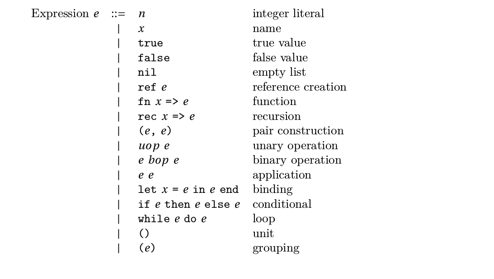

# SimPL Interpreter

An interpreter for an ML dialect which has both functional and imperative language features, 
based on the code skeleton v4.2 provided by [course CS383](http://www.cs.sjtu.edu.cn/~kzhu/cs383/).

## Dependencies

[java-cup-11a.jar](http://www2.cs.tum.edu/projects/cup/)

[src/simpl/parser/JFlex.jar](http://jflex.de/download.html)

## Build and Run

To build, put dependent library jar files into src/simpl/parser/ and run in the root directory:

	make -C src/simpl/parser/
	ant

To run a test:

	java -cp bin/:lib/JFlex.jar:lib/java-cup-11a.jar simpl.interpreter.Interpreter example/[FILE_NAME]

